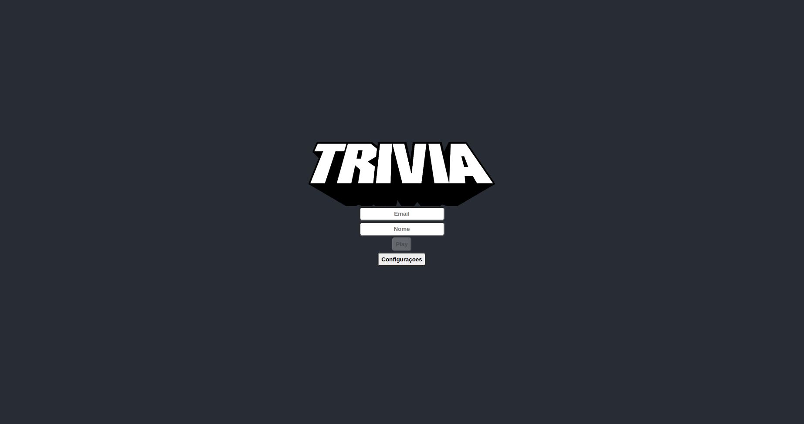
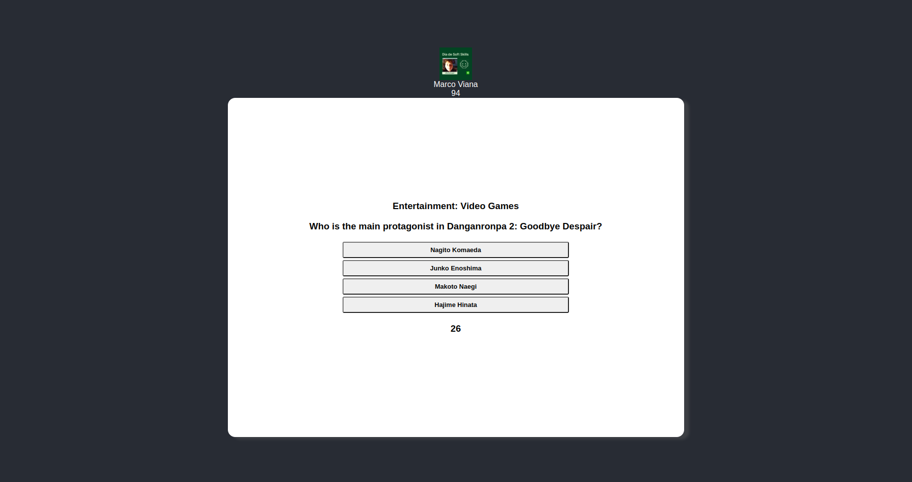

# Trivia React Redux

Implementado em equipe, o projeto consiste em um jogo de perguntas e respostas baseado no jogo Trivia (no estilo show do milhão americano). Desenvolvemos telas como a de login, configurações, jogo, feedback e ranking, utilizando tecnologias como React e Redux. Construímos funcionalidades como seleção de respostas, timer, placar e mensagem de feedback. Também criamos testes automatizados para garantir a qualidade do código. :smile:

<details>
<summary> Aprendizados </summary>
 
- Criar um store Redux em aplicações React
- Criar reducers no Redux em aplicações React
- Criar actions no Redux em aplicações React
- Criar dispatchers no Redux em aplicações React
- Conectar Redux aos componentes React
- Criar actions assíncronas na sua aplicação React que faz uso de Redux.
- Escrever testes para garantir que sua aplicação possua uma boa cobertura de testes.

</details>

## Rodando localmente

Clone o projeto

```bash
  git clone git@github.com:MarcoViana0303/project-trivia-react-redux.git
```

Entre no diretório do projeto

```bash
  cd project-trivia-react-redux
```

Instale as dependências

```bash
  npm install
```

Inicie o servidor

```bash
  npm run start
```


## Documentação

[Para aprender React](https://react.dev/learn)

[Saiba mais sobre Redux](https://redux.js.org/introduction/getting-started)

## Ilustração do projeto

### Tela de Login

### Tela de perguntas


## Desenvolvedores que trabalharam ao meu lado no projeto

- [@Lucas Vieira](https://github.com/beterrabaA)
- [@Lucas Dias](https://github.com/LucasDiasAl)
- [@Ojima Luis](https://github.com/ojimaluis)
- [@Leonardo Luniere](https://github.com/LeonardoLuniere)


## Feedback

Possui alguma dúvida ou encontrou um erro no código? Não deixe de entrar em contato comigo!


## 🔗 Links
[](https://marcoviana-dev.vercel.app/)
[](https://www.linkedin.com/in/marco-viana2022/)
